# All The News That's Fit To Scrape

## Description

A web application that lets users view and leave comments on the latest news. 

Tools Used: **_JQuery_**, **_EJS_**, **_NodeJS_**, **_CSS3_**, **_BootStrap_**, **_MongoDB_**

## Packages Used

Require - _https://www.npmjs.com/package/require_

MongoJS - _https://www.npmjs.com/package/mongojs_

Express - _https://www.npmjs.com/package/express_

Body-Parser - _https://www.npmjs.com/package/body-parser_

Cheerio - _https://www.npmjs.com/package/cheerio_

Axios - _https://www.npmjs.com/package/axios_

Request - _https://www.npmjs.com/package/request_

## Setting Up The Application

1. Downloading The App

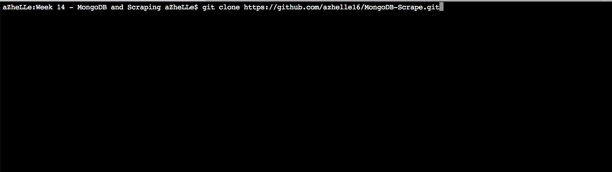

2. Install The Packages Listed 

	- Using the _package.json_ file, run _"npm install"_ inside the Quiz-App folder (see Figure 1)
		- if _"npm audit fix"_ shows up, just run the command after the installation 	
	- The packages listed above should be inside _"node\_modules"_ folder to make the app work. Otherwise, you have to manually download the package (Use the link to see instruction) (see Figure 2)

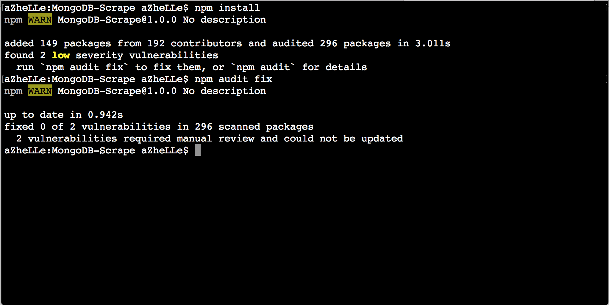

<i>Figure 1: Package Installation</i>

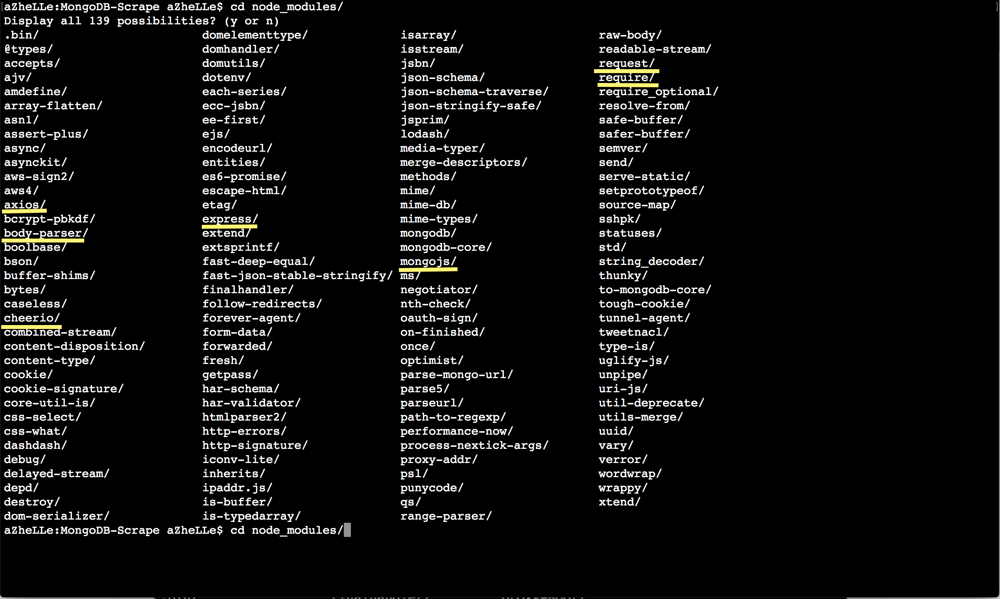

<i>Figure 2: Inside the node_modules folder. The yellow-lined modules are expected to be inside the folder for the app to work.</i>

3. Running The App

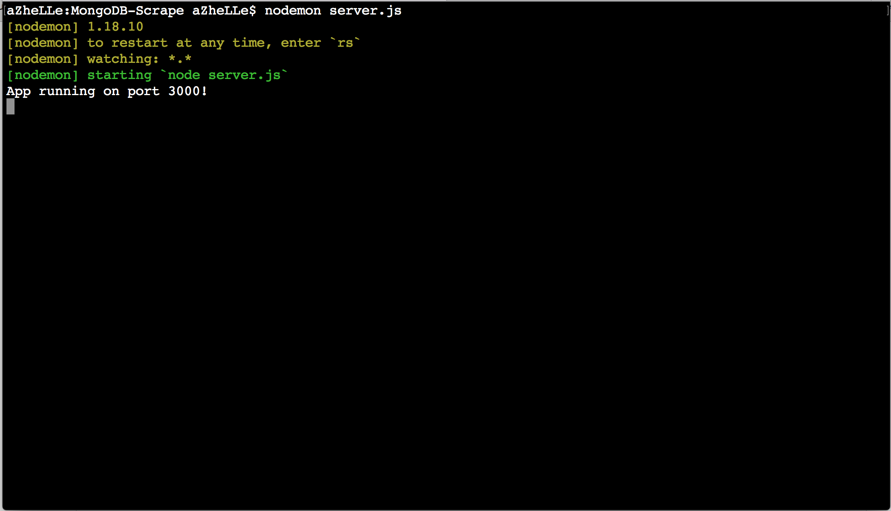

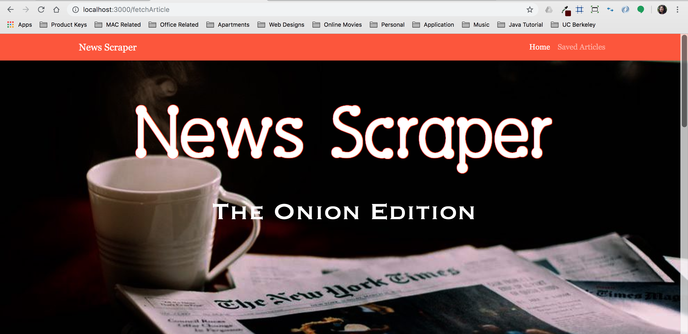

<i>The application on the browser</i>

## Screenshots

1. Home Page Without Scraped Articles

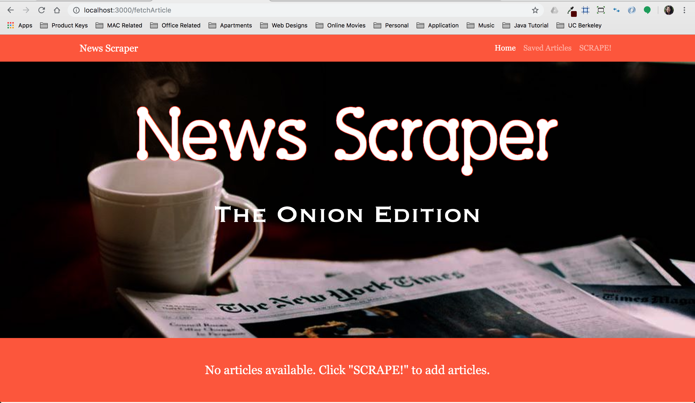

2. Home Page With Scraped Articles

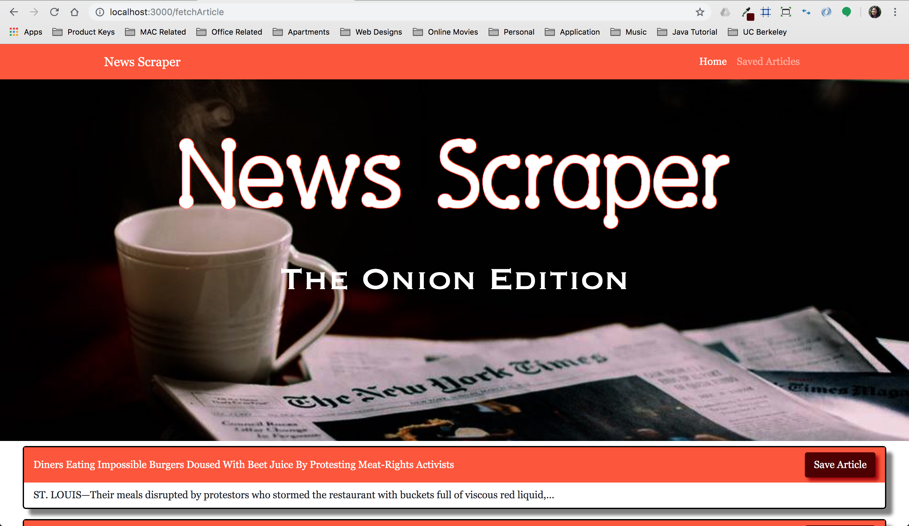

3. Saved Articles Page Without Saved Articles

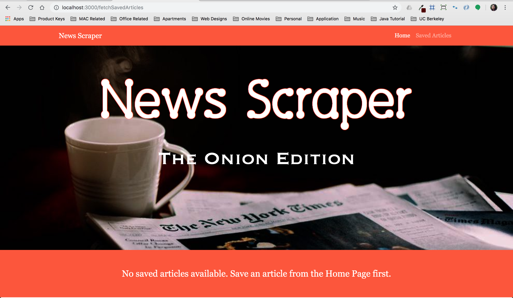

4. Saved Articles Page With Saved Articles

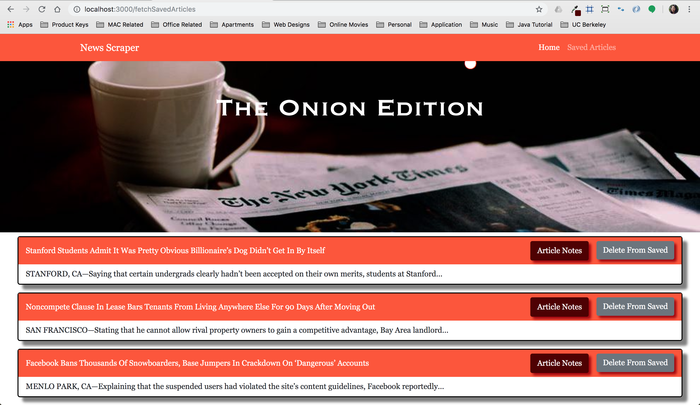

5. Articles Without Comments

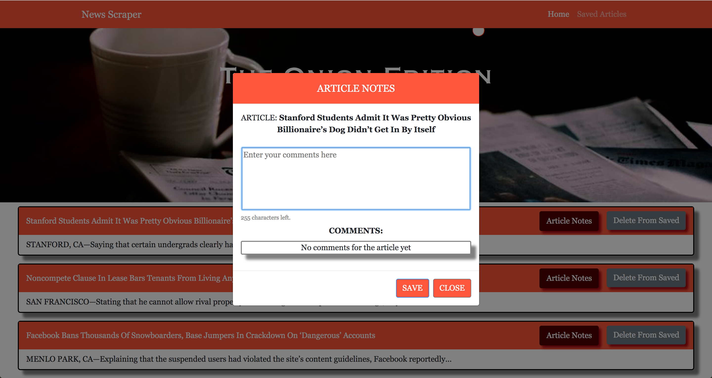

6. Articles With Comments

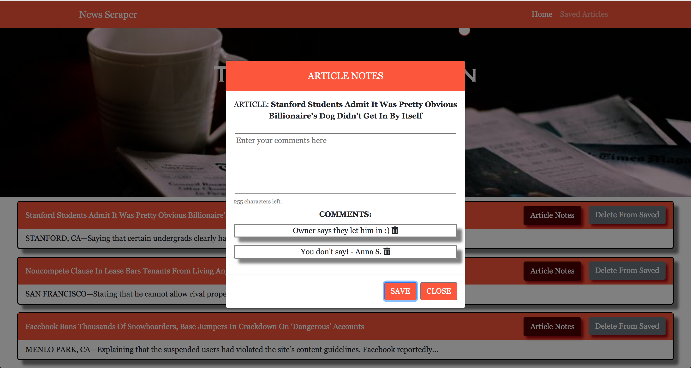

## Credits

News Used For The Project - _https://www.theonion.com/c/news-in-brief_

